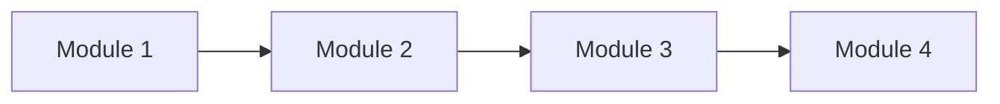

# Deck outline: {Working title}

**Subtitle:** WIF India x {Partner}
**Format:** {N} slides + appendix | {Modular / Single program}
**Status:** Draft v1

Design lens: one sentence on how to pitch this program.

---

## Slide 1 - Title

**{Working title}**

WIF India x {Partner}

{One-line program description}

---

## Slide 2 - Modular program (or program overview)

| Module | What |
|---|---|
| **1. {Module 1}** | |
| **2. {Module 2}** | |
| **3. {Module 3}** | |
| **4. {Module 4}** | |

{Partner} provides: **{confirmed items}**.
WIF provides: **{confirmed items}**.

---

## Slide 3 - Program flow

1.
2.
3.

---

## Slide 4 - Module 1: {name}

-

---

## Slide 5 - Module 2: {name}

-

---

## Slide 6 - Module 3: {name}

-

---

## Slide 7 - Module 4: {name}

-

---

## Slide 8 - Venues / reach

| City | Venue |
|---|---|
| | |

---

## Slide 9 - Timeline

| Phase | Window |
|---|---|
| Prep | |
| Delivery | |
| Finale | |

---

## Slide 10 - Why WIF India

-

---

## Slide 11 - Why {Partner}

-

---

## Slide 12 - Budget / options

| | Option A | Option B |
|---|---|---|
| Scope | | |
| Program fee | USD $TBD | USD $TBD |

---

## Slide 13 - What success looks like

-

---

## Slide 14 - The ask

**Program sponsorship:** Option A USD $TBD / Option B USD $TBD

**From {Partner}**
-

**From WIF**
-

**Decision for WIF:**

---

## Appendix

### A1 - Budget summary

See `../03-budget/budget-outlook.md`.

### A2 - Open items

See `../01-brief/project.md`.
