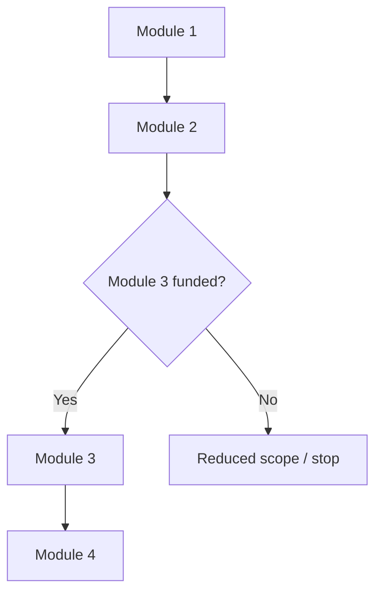

# Program flow: WIF x {Partner}

Visual overview of the modular program.

---

## Simple flowchart

---

## Modular blocks (for partner approval)

Each module can be pitched, approved, or dropped independently.

| Module | What it is | Partner provides | WIF provides |
|---|---|---|---|
| **1. {Name}** | | | |
| **2. {Name}** | | | |
| **3. {Name}** | | | |
| **4. {Name}** | | | |

---

## Step-by-step (one cycle)

### Before events
-

### Module 1
1.

### Module 2
1.

### Module 3
1.

### Module 4
1.

---

## What changed after partner call

| Item | Before | After |
|---|---|---|
| | | |
