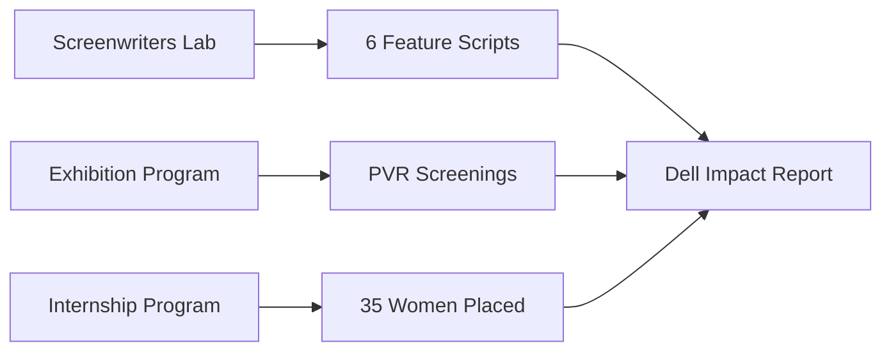

# Deck outline: Get More Women More Jobs.

**Subtitle:** WIF India x Dell
**Format:** 14 slides + appendix | 3-program consolidated sponsorship
**Status:** Draft v1 (post-Rabia intake)

Design lens: Dell sponsors WIF India's impact across development, distribution, or employment. Three independent programs; Dell or EMG picks one.

---

## Slide 1 - Title

**Get More Women More Jobs.**

WIF India x Dell

A consolidated partnership across screenwriting, exhibition, and employment: developing women writers, putting their stories on screen, and placing young women in the industry.

Presented via EMG

---

## Slide 2 - The opportunity

India produces **2,500+ films a year**. Women's participation in key disciplines remains **under 10%**.

WIF India is building the infrastructure to change that: mentorship, labs, internships, and distribution for women in film.

Dell has the opportunity to be the **Presenting Partner** across this pipeline.

---

## Slide 3 - Three programs, one choice

| Program | What | Dell visibility |
|---|---|---|
| **1. Screenwriters Residency Lab** | 6 feature scripts, 6 mentors, residential lab, festival showcase | Presenting Partner; festival credits |
| **2. Exhibition Program** | 6 women-centric films, PVR distribution, 15-20 screenings each | Co-branded premieres; screening slates |
| **3. Internship Program** | 30–35 paid internships/year across 10+ departments | Co-branded certificates; closing ceremony |

Dell or EMG selects **one** program to sponsor (next slide).

---

## Slide 4 - Program options

| Program | Investment |
|---|---:|
| **Screenwriters Residency Lab** | **USD $150,000** |
| **Exhibition Program** | **USD $150,000** |
| **Internship Program** | **USD $200,000 / year** |

Dell or EMG selects one. Each program is fully scoped, delivered, and reported by WIF India.

---

## Slide 5 - Program flow

Three parallel tracks. One Dell partnership. One impact report per sponsored program.

---

## Slide 6 - Program 1: Screenwriters Residency Lab

**Discovering Voices. Crafting Cinema. Driving Change.**

- Pan-India, genre-based feature film development lab
- 6 writers, 6 mentors (Varun Grover, Payal Kapadia, Kiran Rao, and more)
- 3-day residential workshop: Kolkata / Darjeeling
- Festival tie-up: industry showcase + pitching prep
- IP stays with the writer; mandatory WIF credit

**Timeline:** Oct 2025 applications through Aug 2026 festival showcase.

---

## Slide 7 - Program 2: Exhibition Program

**Putting women-led stories on screens across India.**

- WIF curates 6 women-centric / women-led films per year
- PVR partnership: 15-20 screenings per film across 6 cities
- Understated premiere events: filmmaker Q&A, press, social (awareness over glamour)
- Dell co-branded screening intro cards and premiere materials

**Draft scope.** Final numbers pending WIF confirmation.

---

## Slide 8 - Program 3: Internship Program

**Creating tangible pathways to work.**

- 6-month paid internships (₹25,000/month stipend)
- 10+ departments: Direction, Writing, Editing, Production, Cinematography, Entertainment Law, OTT, and more
- 30–35 women per year; optional multi-year extension at $200K/year
- Travel support, host mentorship, certificates
- Closing ceremony with Dell co-branded certificates

---

## Slide 9 - Why WIF India

**Leadership**
- Founded by **Guneet Monga Kapoor**, Oscar-winning producer
- Mentored by **WIF LA**, globally recognized advocacy body
- Led by **Rabia Chopra**, 15 years in program management and gender advocacy

**Reach**
- 3,500+ WIF India members
- Advisory board: Karan Johar, Aparna Purohit, Varun Grover, Ekta Kapoor, and 15+ industry leaders
- Consistent Cannes presence (where the EMG relationship began)

---

## Slide 10 - Why Dell

**Brand fit**
- Dell supports creators, technologists, and storytellers globally
- In-film branding interest (via Sikhya / Raonaq) aligns with WIF's media ecosystem
- Women-in-film sponsorship is a differentiated CSR narrative with measurable outcomes

**What Dell gets**
- Presenting Partner across national programs
- Festival credits, screening slates, employment data
- Annual impact report with writers mentored, films screened, women placed
- Invitation to key events (lab, premieres, closing ceremony)

---

## Slide 11 - Timeline (Year 1)

| Quarter | Lab | Exhibition | Internship |
|---|---|---|---|
| Q1 | Applications; shortlist | Film slate; PVR deal | Partner recruitment |
| Q2 | Treatments; final 6 | First premieres | Internships begin |
| Q3 | Residential lab (May) | Rolling screenings | Internships continue |
| Q4 | Festival showcase (Aug) | Final screenings | Closing ceremony |

---

## Slide 12 - Impact metrics (by program)

| Metric | Lab | Exhibition | Internship |
|---|---|---|---|
| Feature scripts developed | 6 | - | - |
| Films exhibited | - | 6 | - |
| Total screenings | - | 90-120 | - |
| Women interned | - | - | 30-35 |
| Cities reached | 2+ | 6+ | Nationwide |

Annual WIF India Gender Employment Report included with Internship sponsorship.

---

## Slide 13 - Dell branding integration

| Touchpoint | Branding |
|---|---|
| All program materials | Dell logo as Presenting Partner |
| Screenwriters Lab | "Supported by Dell" on pitch decks, festival submissions |
| Exhibition premieres | Co-branded step-and-repeat; screening intro cards |
| Internship certificates | Dell + WIF co-signed |
| Impact reporting | Annual report with Dell metrics |

In-film product placement (Sikhya / Raonaq) is a parallel track. WIF facilitates the introduction.

---

## Slide 14 - The ask

**Dell or EMG selects one program:**

- Screenwriters Lab: **USD $150,000**
- Exhibition Program: **USD $150,000**
- Internship Program: **USD $200,000 / year**

**From Dell**
- Program sponsorship (one of three)
- Presenting Partner status across the sponsored program
- Optional: representative at key events

**From WIF India**
- Full program design and delivery
- Mentor curation, PVR partnership, or internship placements (per program)
- Annual impact report and M&E
- Introduction to Sikhya / Raonaq for in-film branding

**Also available:** WIF program charter with full menu of additional programs.

---

## Appendix

### A1 - Budget summary

See `../03-budget/budget-outlook.md`. Lab: $150K. Exhibition: $150K. Internship: $200K/year.

### A2 - Screenwriters Lab mentors (proposed)

Varun Grover, Juhi Chaturvedi, Smita Singh, Payal Kapadia, Kiran Rao, Bhavani Iyer, Gauri Shinde, Sumit Roy, Seeta Menon, Pooja Surti.

### A3 - Internship departments

Direction, Writing, Editing, Production, Costume, Art, Casting, Entertainment Law, OTT Programming, Cinematography, Production Design.

### A4 - Exhibition Program assumptions (draft)

6 films/year, 15-20 PVR screenings each, 6 cities, understated premiere format. Pending Rabia confirmation.

### A5 - Multi-year internship extension

Internship: $200K/year for 30–35 women per cohort. Optional follow-on years at same rate.
