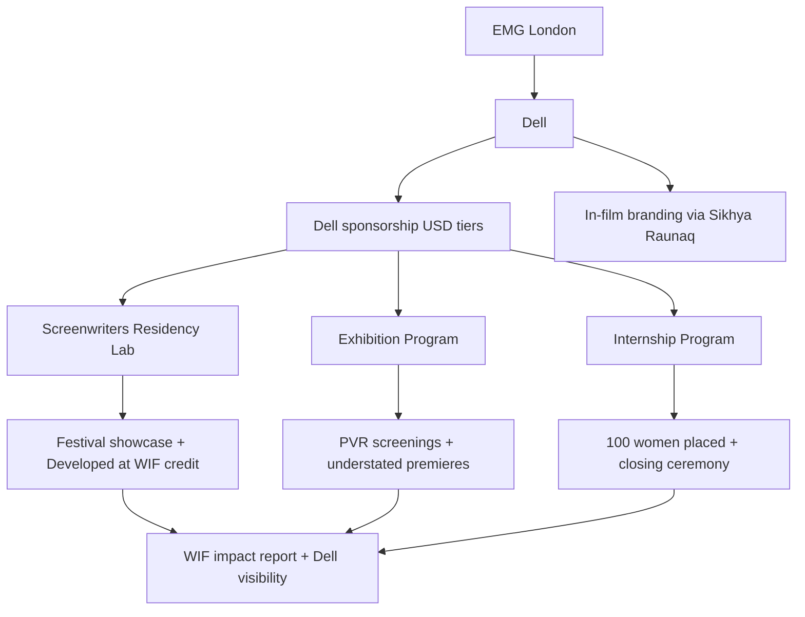

# Program flow: WIF x Dell

Visual overview of the consolidated Dell sponsorship across three WIF India programs.

---

## Partnership flow

---

## Three programs (for Dell approval)

Each program can be sponsored independently or as a bundle. Tier 1 = Lab only. Tier 2 = Lab + Exhibition. Tier 3 = all three (Internship Year 1).

| Program | What it is | Dell visibility | WIF delivers |
|---|---|---|---|
| **1. Screenwriters Residency Lab** | Pan-India genre lab; 6 feature scripts; residential mentorship | Presenting partner on all lab comms, festival showcase, "Developed at WIF India Screenwriters Lab, supported by Dell" credit | Applications, jury, mentors, residential lab, festival tie-up |
| **2. Exhibition Program** | Distribution channel for women-centric / women-led films via PVR | Presenting partner on premiere events, screening slates, marketing | Film selection, PVR partnership, 15-20 screenings/film, understated premieres |
| **3. Internship Program** | Paid 6-month internships for young women across 10+ departments | Presenting partner on certificates, closing ceremony, annual impact report | Placements, stipends, travel, host mentorship, M&E |

---

## Step-by-step (parallel tracks)

### Track 1: Screenwriters Lab (Oct 2025 - Aug 2026)

1. **Oct 2025:** National call for applications (2-page concept, genre specified)
2. **Dec 2025:** Shortlist top 50 (pre-jury)
3. **Jan-Feb 2026:** Treatment phase (5-page treatments from shortlisted writers)
4. **Mar 2026:** Final 6 scripts selected (one per mentor)
5. **May 2026:** Writers Lab Part 1 - 3-day residential workshop (Kolkata/Darjeeling)
6. **Aug 2026:** Writers Lab Part 2 - festival tie-in showcase + pitching prep

### Track 2: Exhibition Program (rolling, Year 1)

1. **Q1:** Curate slate of 6 women-centric / women-led films for Year 1
2. **Q1-Q2:** Secure PVR partnership (target: 15-20 screenings per film)
3. **Q2-Q4:** Roll out premieres (understated red carpet; awareness over glamour)
4. **Ongoing:** Multi-city screening windows; social and press coverage
5. **Year-end:** Impact report: screenings, attendance, filmmaker reach

### Track 3: Internship Program (Year 1 of 3)

1. **Q1:** Partner with 10+ production houses, OTT platforms, channels
2. **Q1-Q2:** Recruit and place first cohort (35 interns)
3. **Q2-Q4:** 6-month paid internships with host mentorship
4. **Q4:** Closing ceremony; certificates co-branded Dell + WIF; impact metrics

---

## Dell branding integration

| Touchpoint | Branding |
|---|---|
| All program materials | Dell logo as Presenting Partner |
| Screenwriters Lab credits | "Supported by Dell" on pitch decks, festival submissions |
| Exhibition premieres | Dell co-branded step-and-repeat (toned down); screening intro cards |
| Internship certificates | Dell + WIF co-signed; closing ceremony invite for Dell rep |
| Impact reporting | Annual report with Dell metrics: writers mentored, films screened, women placed |

**In-film branding** (product placement via Sikhya / Raunaq) runs as a parallel track outside WIF program delivery. WIF facilitates the introduction; placement negotiation is separate.

---

## What changed from intake sources

| Item | Source doc | Dell proposal adaptation |
|---|---|---|
| Screenwriters Lab | Kolkata govt / IFFI framing | Reframed for Dell corporate sponsorship via EMG |
| Internship | Kamla Mills / MIB funding ask | Reframed as Tier 3 component; USD pricing |
| Exhibition | Rabia voice note only | Full first draft with PVR model and budget assumptions |
| Pricing | INR government/foundation asks | USD tiered sponsorship; INR internal only |
