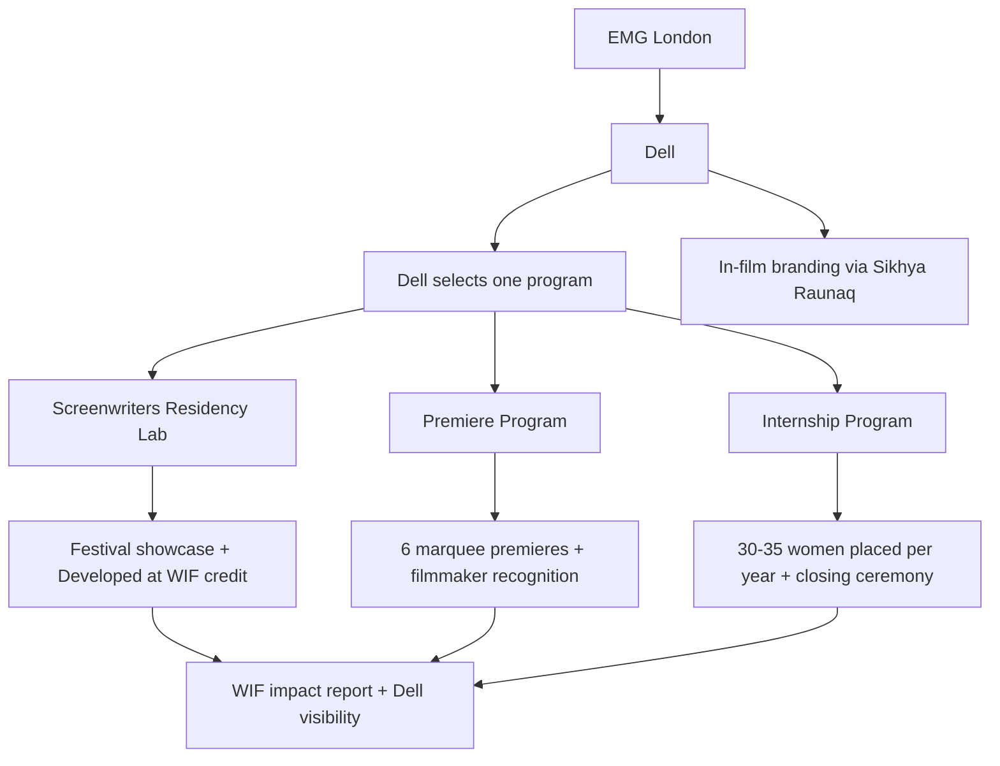

# Program flow: WIF x Dell

Visual overview of the consolidated Dell sponsorship across three WIF India programs.

---

## Partnership flow

---

## Three programs (for Dell approval)

Dell or EMG selects **one** of three independent programs. Each is fully scoped and priced separately.

| Program | What it is | Dell visibility | WIF delivers |
|---|---|---|---|
| **1. Screenwriters Residency Lab** | Pan-India genre lab; 6 feature scripts; residential mentorship | Presenting partner on all lab comms, festival showcase, "Developed at WIF India Screenwriters Lab, supported by Dell" credit | Applications, jury, mentors, residential lab, festival tie-up |
| **2. Premiere Program** | High-impact industry premiere per women-led film | Presenting partner on premiere events, press, marketing | Film selection, premiere production, 6 marquee premieres per year |
| **3. Internship Program** | Paid 6-month internships for young women across 10+ departments | Presenting partner on certificates, closing ceremony, annual impact report | Placements, stipends, travel, host mentorship, M&E |

---

## Step-by-step (parallel tracks)

### Track 1: Screenwriters Lab (July 2026 - May 2027)

1. **July 2026:** National call for applications (2-page concept, genre specified)
2. **September 2026:** Shortlist top 50 (pre-jury)
3. **Oct-Nov 2026:** Treatment phase (5-page treatments from shortlisted writers)
4. **December 2026:** Final 6 scripts selected (one per mentor)
5. **February 2027:** Writers Lab Part 1 - 3-day residential workshop (Kolkata/Darjeeling)
6. **May 2027:** Writers Lab Part 2 - festival tie-in showcase + pitching prep

### Track 2: Premiere Program (rolling, Year 1)

1. **Q1:** Curate slate of 6 women-led films for Year 1
2. **Q1-Q2:** Premiere planning (venues, industry guest list, press, production)
3. **Q2-Q4:** Roll out 6 marquee industry premieres
4. **Year-end:** Impact report: premieres held, press coverage, filmmaker reach

### Track 3: Internship Program (annual)

1. **Q1:** Partner with 10+ production houses, OTT platforms, channels
2. **Q1-Q2:** Recruit and place cohort (30–35 interns)
3. **Q2-Q4:** 6-month paid internships with host mentorship
4. **Q4:** Closing ceremony; certificates co-branded Dell + WIF; impact metrics

---

## Dell branding integration

| Touchpoint | Branding |
|---|---|
| All program materials | Dell logo as Presenting Partner |
| Screenwriters Lab credits | "Supported by Dell" on pitch decks, festival submissions |
| Premiere events | Dell co-branded premiere materials; high-impact PR event |
| Internship certificates | Dell + WIF co-signed; closing ceremony invite for Dell rep |
| Impact reporting | Annual report with Dell metrics: young women filmmakers mentored, films premiered, women placed |

**In-film branding** (product placement via Sikhya / Raunaq) runs as a parallel track outside WIF program delivery. WIF facilitates the introduction; placement negotiation is separate.

---

## What changed from intake sources

| Item | Source doc | Dell proposal adaptation |
|---|---|---|
| Screenwriters Lab | Kolkata govt / IFFI framing | Reframed for Dell corporate sponsorship via EMG |
| Internship | Kamla Mills / MIB funding ask | Standalone option; $200K/year USD pricing |
| Exhibition | Rabia voice note only | Reframed as Premiere Program: one high-impact premiere per film, no multi-screening distribution |
| Pricing | INR government/foundation asks | USD per-program options; INR internal only |
