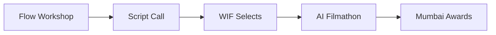

# Deck outline: One Prompt. A Thousand Stories.

**Subtitle:** WIF India x Google Flow
**Format:** 14 slides + appendix | Modular program (4 modules)
**Status:** Draft v4 (post-Prashant call)

Design lens: modular Google Flow activation. Google gives the expert. WIF may fund Filmathon credits. Proposal can be split for US team approval.

---

## Slide 1 - Title

**One Prompt. A Thousand Stories.**

WIF India x Google Flow

A modular pan-India program: Flow workshops, a national script call, an AI Filmathon, and a Mumbai awards showcase.

---

## Slide 2 - Modular program (4 blocks)

Pitch each module independently for Google US approval.

| Module | What |
|---|---|
| **1. Flow Workshop Events** | Combined college events: students + professionals, networking, Google Flow demo |
| **2. Script Call** | National AI-themed topic; open script submissions; WIF curation |
| **3. AI Filmathon** | Selected filmmakers produce fully AI shorts in Google Flow (WIF-funded access) |
| **4. Awards Ceremony** | Mumbai screening; jury; 1st, 2nd, 3rd place; PR event |

Google provides: **Flow expert** (confirmed).
WIF provides: venues, production, curation, credits (if Module 3 runs), awards event.

---

## Slide 3 - Program flow

1. Combined college event with Google Flow expert
2. National script call opens (AI theme, positive portrayal)
3. WIF curates and selects scripts
4. Selected filmmakers get Flow access and produce AI shorts
5. Jury awards Top 3 at Mumbai PR event

---

## Slide 4 - Module 1: combined Flow workshop event

**One event, two audiences.** Students and professionals together at college venues.

- Google Flow expert leads demo / workshop
- Full filmmaking pipeline in Flow: story, visuals, scenes, iteration
- Networking between students and industry
- 100+ attendees per city
- YouTube livestream
- Script call topic announced at close

Venues: Whistling Woods, FTII or Symbiosis, SRFTI or St. Xavier's, AAFT, LV Prasad, Annapurna, Srishti Manipal.

---

## Slide 5 - Module 2: script call

After workshops, WIF opens a **national script call**.

- Topic: films **about AI** with a **positive** portrayal (Google direction)
- Open to anyone interested, not only event attendees
- Writers submit scripts (length TBD)
- WIF curates: e.g. 100 submissions -> 50 shortlist -> 30-50 selected for Filmathon

This separates interest (wide) from production (curated).

---

## Slide 6 - Module 3: WIF x Google AI Filmathon

**Google credits are out of scope.** If WIF runs this module, WIF funds Flow access.

- Selected filmmakers receive Flow access (~₹3,000/filmmaker planning budget)
- Production window: **7-14 days** (more realistic than 48 hours)
- Output rules:
  - Fully AI-generated in Google Flow
  - No live-action footage
  - On-brief: AI theme, positive framing

| Scale | WIF credit budget (approx.) |
|---|---:|
| 30 filmmakers | ₹90,000 |
| 50 filmmakers | ₹1,50,000 |

---

## Slide 7 - Module 4: Mumbai awards / PR event

- Screen WIF-selected films
- Jury: WIF + industry leaders (+ Google presence)
- Award **1st, 2nd, 3rd place**
- **Prize:** 1-year free Google Flow subscription for all three winners
- PR moment for Google Flow + WIF India
- YouTube / social amplification

---

## Slide 8 - Why Google Flow

Google's focus for this partnership is **Flow**, not generic AI.

| Flow capability | Filmmaking use |
|---|---|
| Veo 3.1 | Generative video, shot tests, scenes |
| Imagen / ingredients | Characters, costume, props, art dept |
| Gemini (in Flow) | Script, prompts, scene logic |
| Scenebuilder | Assemble AI footage into scenes |
| Flow TV | Showcase reference for finished work |

---

## Slide 9 - Film rules (Google requirements)

- **Fully AI-generated** in Google Flow
- **No live-action / real-life footage**
- Film must be **about AI**
- Must reflect the **positive side of AI**

Keeps judging and eligibility clean.

---

## Slide 10 - Venues and scale

- **7-14 combined college events** over 6 months
- **100+ attendees** per event
- **3,500 WIF members** for outreach
- National script call after events
- **30-50** filmmakers funded for Filmathon (if Module 3 runs)

---

## Slide 11 - Roles: who brings what

| | Google | WIF India |
|---|---|---|
| **Flow expert** | Yes (confirmed) + travel package | Host, moderate, produce |
| **Flow credits** | No | Yes, if Filmathon runs |
| **Co-branding** | Yes | Yes |
| **Venues + events** | - | Yes |
| **Script curation** | - | Yes |
| **Awards event** | Presence + amplification | Production, jury, prizes |

---

## Slide 12 - Timeline (6 months)

| Month | Activity |
|---|---|
| M1 | Prep, modular proposal to Google US, venues locked |
| M2-M5 | Module 1 events + Module 2 script calls (rolling) |
| M3-M5 | Module 3 Filmathon (if funded) |
| M6 | Module 4 Mumbai awards + PR |

---

## Slide 13 - What Google gets

- **Pan-India Flow demos** to film students and professionals
- **Expert-led workshops** at top film institutes
- **YouTube reach** beyond the room
- **AI-positive short films** made in Flow (if Filmathon runs)
- **Mumbai awards moment** with industry leaders
- **Modular proposal** easy for US team to approve in phases

---

## Slide 14 - The ask

**Program sponsorship (TBD):** Option A USD $100,000 / Option B USD $150,000

**From Google (confirmed / requested)**
- Flow expert across events
- Co-branding on Flow-focused program
- US team approval of modular proposal (Modules 1-4 or phased)
- Optional: YouTube / Google India amplification for awards

**From WIF**
- Event production at colleges
- National script call + curation
- Flow access for selected filmmakers (Module 3, WIF-funded)
- Mumbai awards event

**Decision for WIF:** Run all 4 modules, or start with Modules 1+2 and add Filmathon when budget is confirmed.

---

## Appendix

### A1 - WIF budget summary

See `budget-outlook.md`. Module 3 alone: ₹90k-1.5L. Full program: ₹13L-44L.

### A2 - Flow credit pricing (India)

| Plan | INR/mo | Credits |
|---|---:|---:|
| AI Plus | ₹399 | 200 |
| AI Pro | ₹1,950 | 1,000 |
| AI Ultra | ₹6,500 | 10,000 |

Veo Fast = 20 credits/gen. Quality = 100 credits/gen.

### A3 - Responsible AI

- Disclose AI-generated elements
- No real-person likeness without consent
- AI-positive thematic brief aligned with Google direction
