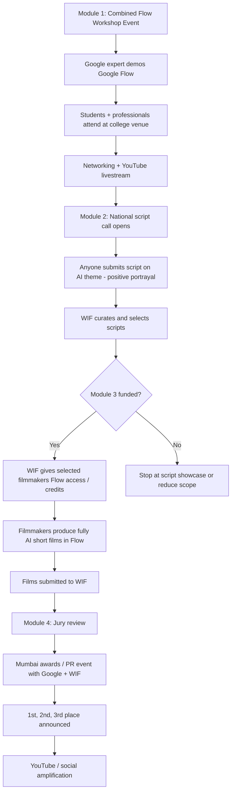

# Program flow: WIF x Google Flow

Visual overview of the modular program after the Prashant call.

---

## Simple flowchart

---

## Four modular blocks (for US / Google approval)

Each module can be pitched, approved, or dropped independently.

| Module | What it is | Google provides | WIF provides |
|---|---|---|---|
| **1. Flow Workshop Events** | Combined college event: students + professionals, networking + Google Flow demo | Expert / expert roster | Venues, audience, production, livestream |
| **2. Script Call** | National topic announced; open script submissions; WIF curation | Co-branding, topic alignment | Portal, comms, curators, selection |
| **3. AI Filmathon** | Selected scripts get Flow access; filmmakers produce short AI films | Flow product focus, expert curriculum | **Credits/subscriptions**, Filmathon ops, mentoring |
| **4. Awards Ceremony** | Mumbai screening + jury + Top 3 awards + PR | Co-branding, possible amplification | Event production, jury, prizes, guest list |

---

## Step-by-step (one cycle)

### Before events
- Lock modular proposal (which modules are in scope)
- Confirm venues (colleges / film institutes)
- Confirm Google expert schedule
- Define national script topic (AI-themed, positive)

### Module 1: Event day(s)
1. WIF hosts combined event at college (students + professionals)
2. Google expert leads Google Flow workshop / demo
3. Audience sees full filmmaking pipeline in Flow
4. Optional YouTube livestream
5. WIF announces the script call topic at the end

### Module 2: Script phase (1-2 weeks)
1. Open submissions nationally (not limited to attendees)
2. Writers submit scripts (length TBD, e.g. 3-5 pages)
3. WIF internal review -> shortlist
4. WIF selects final filmmakers to enter Filmathon

### Module 3: Filmathon (7-14 days recommended)
1. WIF provisions Flow access (Pro accounts or credit pool)
2. Filmmakers produce fully AI-generated shorts in Flow
3. Rules: no live-action footage; film must be about AI positively
4. WIF runs office hours / FAQ channel
5. Films submitted by deadline

### Module 4: Awards (Mumbai)
1. Jury screens WIF-selected films
2. Mumbai awards / PR event with Google + WIF + industry leaders
3. Announce 1st, 2nd, 3rd place
4. Each winner receives a 1-year free Google Flow subscription
5. Publish winners on YouTube / social

---

## What changed after Prashant call

| Item | Before | After |
|---|---|---|
| Google credits | Asked Google for free tokens | **Out of scope** - WIF funds if Filmathon runs |
| Product focus | Generic Google AI | **Google Flow** app |
| Audience format | Separate student + professional tracks | **Combined college event** with networking |
| Filmathon entry | Workshop attendees | **Open script call** -> WIF selects |
| Film theme | Pipeline demo | Must be **about AI**, **positive** portrayal |
| Proposal shape | Single program | **Modular** (4 modules, mix-and-match) |
| Google provides | Expert + credits hoped | **Expert only** (confirmed) |
